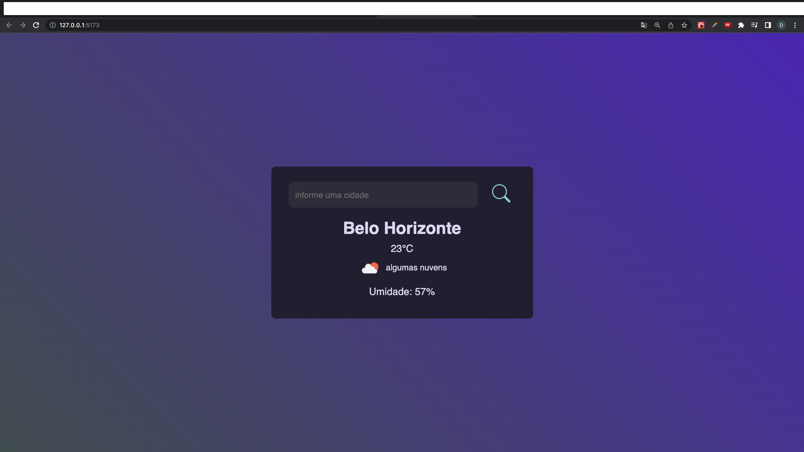

 ## 💻 Projeto Weather Forecast

Este projeto foi criado com o objetivo de praticar minhas habilidades em React, utilizando o framework para consumir uma API pública que fornece dados de previsão do tempo. Para isso, utilizei hooks e a biblioteca axios para desenvolver um aplicativo de previsão do tempo.

O projeto me permitiu aprimorar minhas habilidades em React, incluindo o uso de hooks para gerenciar o estado do aplicativo e a integração com uma API externa usando o axios. Além disso, pude aperfeiçoar minhas habilidades de design e layout, criando uma interface de usuário intuitiva e agradável.

### Rodando o Projeto

### ⚙ Configurações 

1- Clone este repositorio

 $ git clone https://github.com/diegofchagas/weather-forecast.git

 2- Acesse a pasta do projeto no terminal/cmd

$ cd weather-forecast

3- Para instalar as dependências:
> npm i

4- Para iniciar a aplicação:
> npm run dev

 ## :rocket: Tecnologias

Esse projeto foi desenvolvido com as seguintes tecnologias:

✔️Javascript

✔️Axios

✔️React-vite

## Desenvolvedor Diego Chagas